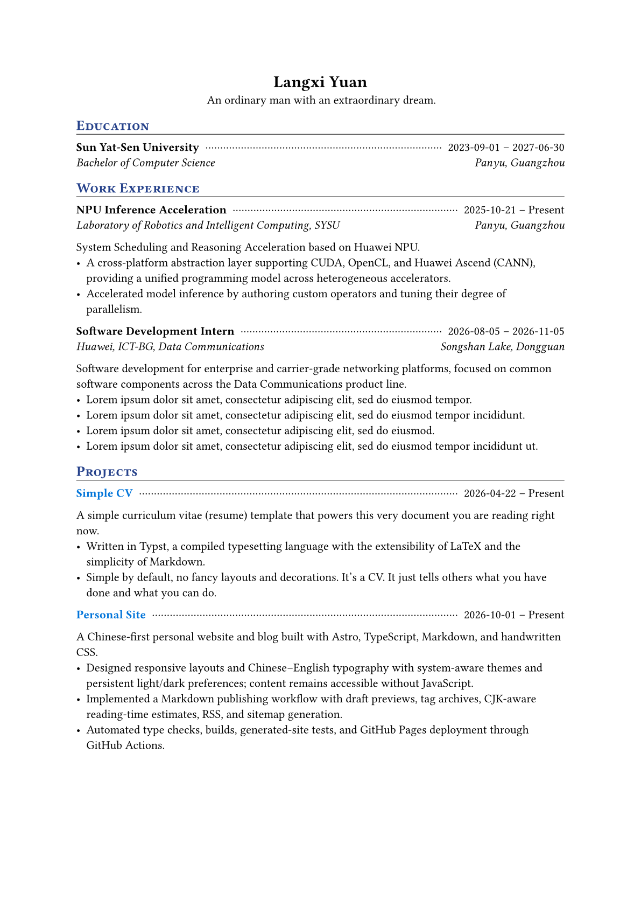

# simple-cv

A simple curriculum vitae (resume) template written in Typst.

## Sample

## Licensing

This package is dual-licensed by path.
- Files under `template/` are licensed under [MIT-0](template/LICENSE). Use it freely without attribution.
- Everything else in this repo are licensed under [MIT](LICENSE).

The [`license`](https://github.com/typst/packages/blob/main/docs/manifest.md) field in `typst.toml` declares the package default (MIT); files carrying a `SPDX-License-Identifier` comment are licensed separately as listed above.
